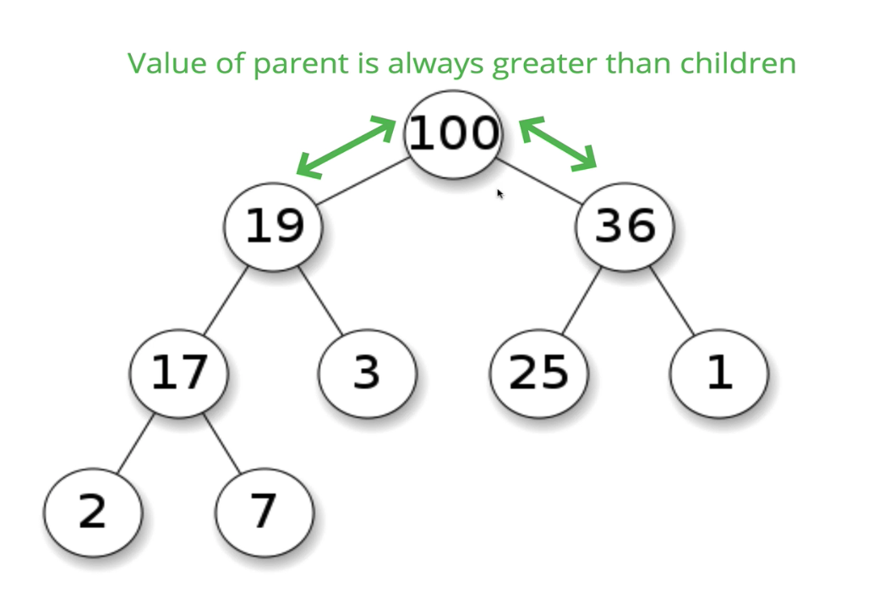
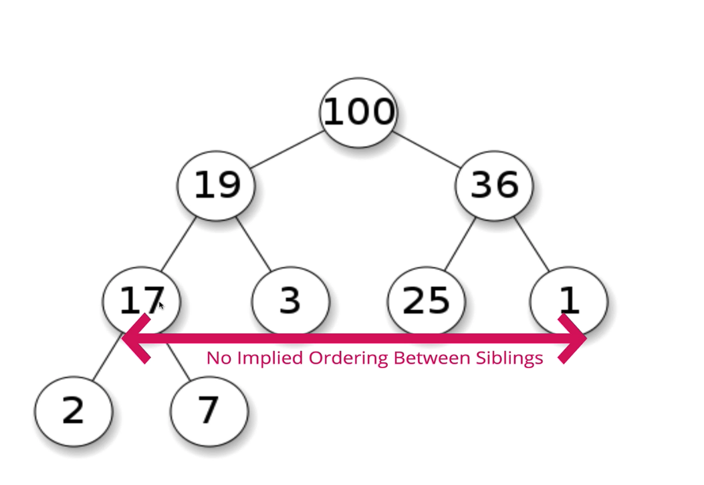
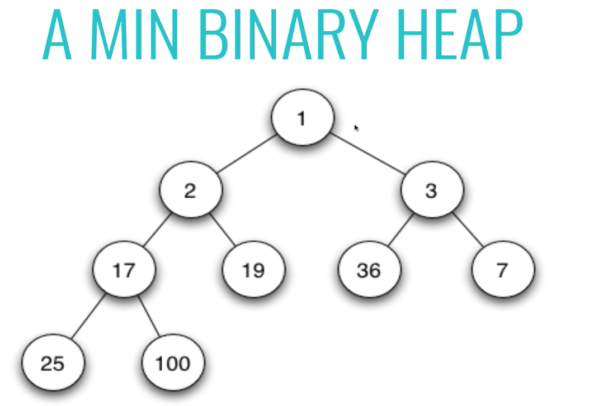

# Binary Heaps

- Another category of trees technically
- Everything that applies to trees in general, applies to heaps
- Many types of heaps: fibonacci, leftist, soft, etc
- We'll focus on binary heaps, two different types: min and max
- **MaxBinaryHeap**: parent nodes are always larger than child nodes
- **MinBinaryHeap**: parent nodes are always smaller than child nodes
- Each node can have at most two children, but there is no order to the left versus right. No order, just that parents are smaller/larger than child nodes. No relationship to root necessarily like in a binary search tree.
- Binary heaps are used to implement **Priority Queues**, which are very commonly used data structures
- Also used frequently with graph traversal algorithms

## Max Binary Heap

- Each parent has at most two child nodes
- The value of each parent node is always greater than its child nodes
- In a max Binary Heap the parent is greater than the children, but there are no guarantees between sibling nodes
- A binary heap is as compact as possible. All the children of each node are as full as they can be and left children are filled out first

## Min Binary Heap

- Each parent has at most two child nodes
- The value of each parent node is always less than its child nodes

## Implementation of Binary Heaps

- Easiest way of storing a binary heap is a list or array
- For any index of an array n... the left child is stored at 2n+1 and the right child is stored at 2n+2
- For any child node at index n... its parent is at index Math.floor((n-1)/2)
