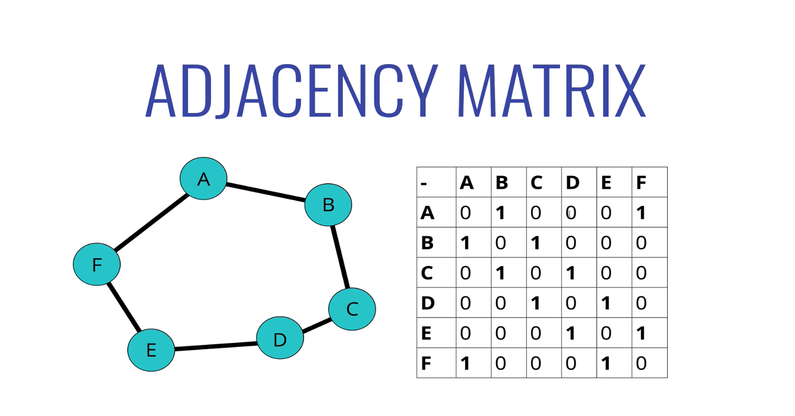
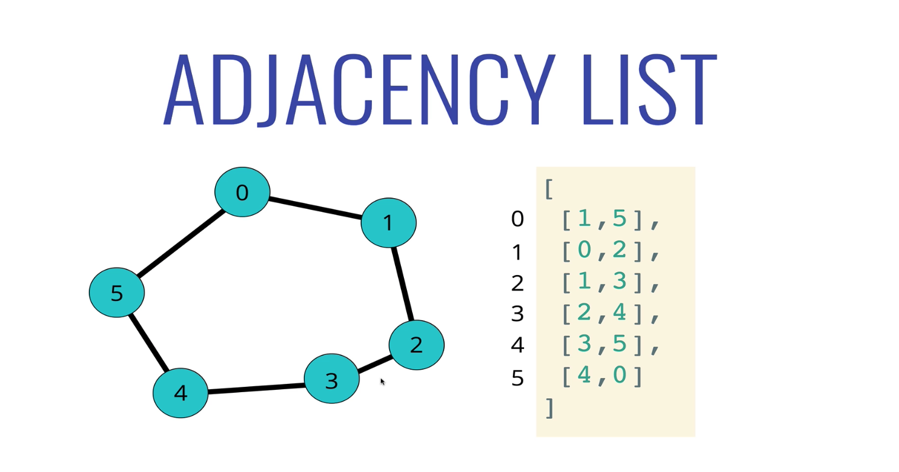
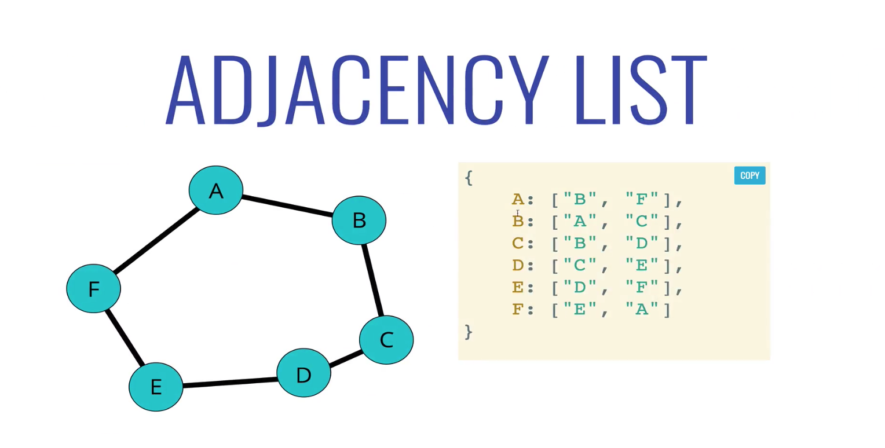
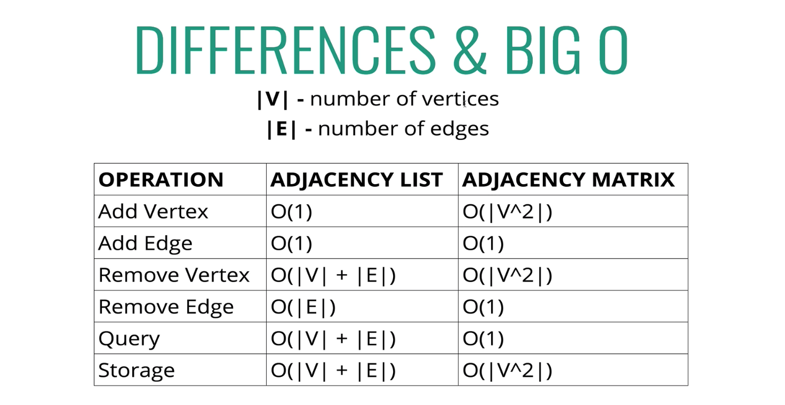

# Graphs

- Graphs are collections of nodes (vertexes) and connections between the nodes
- Uses for graphs: social networks, location/mapping, routing alorithms, visual hierarchy, file system optimizations
- Recommendations on the internet: "people also watched", "you might also like...", "people you might know", "frequently bought with" are all examples of real world graph data structures at work

## Graph Terminology

- Vertex: a node
- Edge: connection between nodes
- Weighted/Unweighted:
- Directed/Undirected:

## Types of Graphs

- Undirected Graph: no direction to the edges, two way connections (Facebook for example, two way friends, you see their content and they see yours)
- Directed Graph: there is a direction assigned to the edge (Instagram for example, a lot of people might follow a celebrity, but that celebrity does not follow everyone or see their content)
- Weighted Graph: each edge has a value/weight, offers information about the connection itself (Mapping for example, with mileage between vertices)
- Unweighted Graph: no values or weights associated with each edge

## Representing a Graph

- Adjacency Matrix: nested array representation of where there are edges in a graph (0 to denote no edge, 1 to denote an edge connection)

- Adjacency List: use an array or hash table to store the edges

## Adjacency Matrix vs List Big O

- Adjacency List:
  - Good: can take up less space (in sparse graphs), faster to iterate over all edges
  - Bad: can be slower to lookup a specific edge
- Adjacency Matrix:
  - Good: faster to lookup specific edge
  - Bad: takes up more space (in sparse graphs), slower to iterate over all edges
- We'll use an adjacency list, because most data in the real world tends to lend itself to sparser and/or larger graphs

## Dijkstra's Algorithm

- Find the shortest path between two vertices on a graph, answers the question of the fastest way to get from point A to point B
- Shortened from Dijkstra's shortest path algorithm, one of the most famous algorithms out there

### Example Use Cases

- GPS: finding fastest route
- Network routing: finds open shortes path for data
- Biology: used to model the spread of viruses among humans
- Airline tickets: finding cheapest route to your destination
