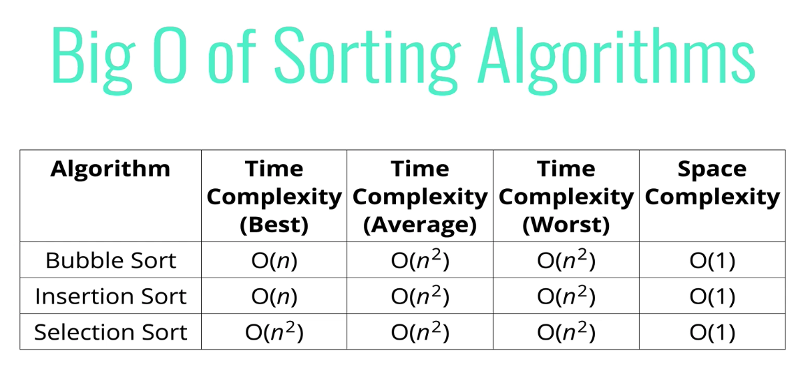
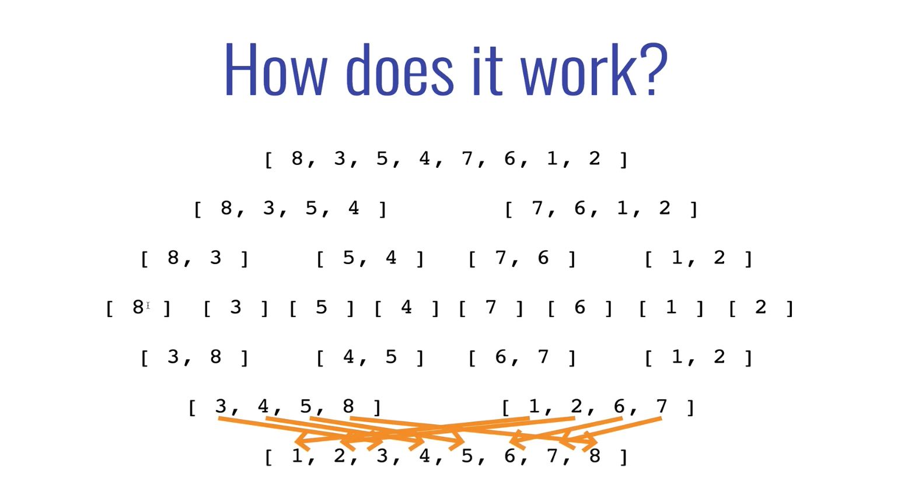

# Sorting Algorithms

## Elementary (Quadratic) Sorting Algorithms

### Bubble Sort

- Works best if data is nearly sorted
- Fairly inefficient, and therfore not commonly used
- Sorting algorithm where the largest value "bubbles" to the top
- As you loop through the array, you compare the value to the next value, if it's larger you swap the two and then compare the next
- Fewer elements to go through with each iteration
- Can be optimized with a boolean variable, if true that there are no swaps on that iteration, can break out and avoid unnecessary iterations
- Big O time: O(n^2)
- Big O space: O(1)

### Selection Sort

- In a way, the inverse of bubble sort (largest values bubble to the top), in this case we assign the smallest values first and move up from there
- Also fairly inefficient, have to compare every element to every other element, making one less comparison each iteration
- Still not efficient in the case of almost sorted data
- Selection sort is better than bubble sort in one specific scenario: only make one formal swap at the end of each loop, instead of swapping every time like bubble sort
- Big O time: O(n^2)
- Big O space: O(1)

### Insertion Sort

- If data is almost all sorted, this can be an efficient sorting algorithm
- Keeping one side of the array sorted, and adding one item in one at a time, can be good for continuous singular data coming in and needing to find the correct place for it
- Big O time: O(n^2)
- Big O space: O(1)

## Intermediate Sorting Algorithms

### Merge Sort

- Works by decomposing an array into smaller arrays of 0 or 1 elements, then building back up a newly sorted array
- Works best with a helper function which merges two sorted arrays
- Recursively, we break down the array into smaller 1 element arrays, and then call the merge helper function to merge the two smaller arrays back together
- Big O time: O(n log(n))
- Big 0 space: O(n)

